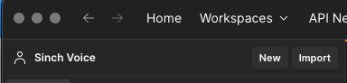
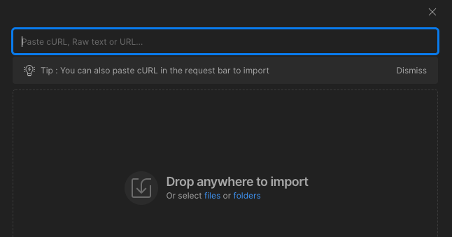
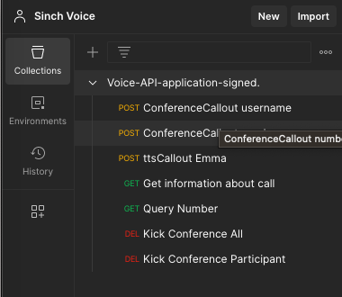
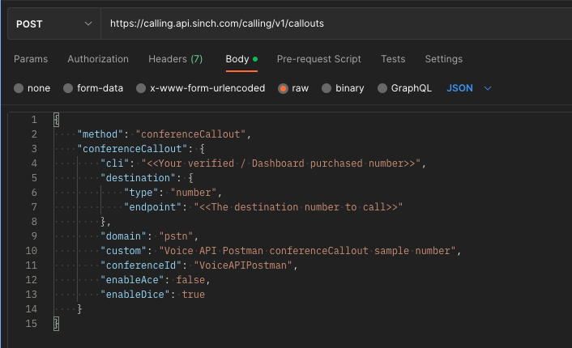
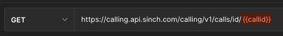
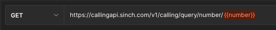
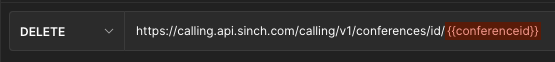
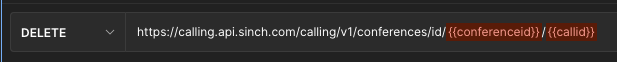

# Sinch Voice API Postman Collection

## Application signed Postman requests

This Postman collection is a sample set of Sinch Voice API requests using application signing.

### Requirements

- [Postman](https://www.postman.com/downloads/)

### Install

1. Import the collection into Postman, by selecting the **Import** button

    

2. Drag or select the collection from this repository ```Voice-API-application-signed.postman_collection.json``` into the import dialog.

    

3. The collection will show a small example set of API callouts and requests

    

4. Add your application key and secret from your [Dashboard](https://dashboard.sinch.com/voice/apps) to the ```appKey``` and ```appSecret``` Variables tab of the collection.

    

5. Add the rest of the following variables:

    

You can now send a request.

### Items to change in the POST examples

* ```cli:``` Your verified / Dashboard purchased number
* ```endpoint:``` The destination number to call
* ```conferenceid:``` Add the conference id of your choice


### Items to change in the GET / DELETE examples

Postman variables are used, but do not resolve to any values, please replace the variables in place (the actual URLs) to use correctly



```{{callid}}``` Enter a valid call-id



```{{number}}``` A valid PSTN number to query



```{{conferenceid}}``` A valid conferenceId



```{{conferenceid}}``` A valid conferenceId
```{{callid}}``` Enter a valid call-id

### Debug
If you want to see the request signing steps output, you can use the postman console to view.

